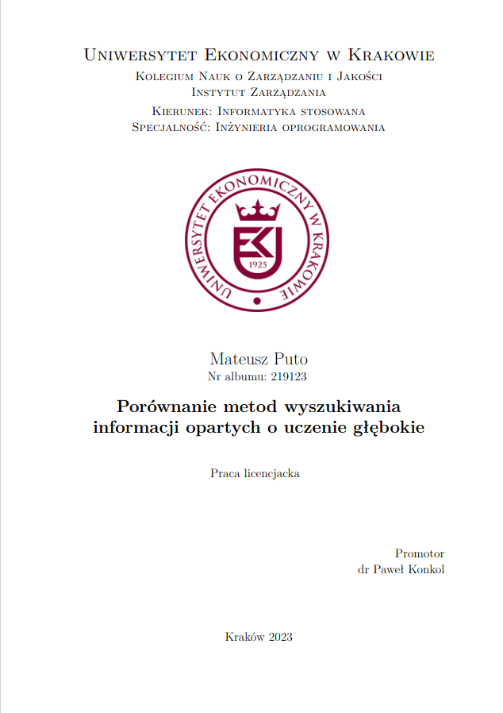

# Porównanie metod wyszukiwania informacji opartych o uczenie głębokie

PL:
Praca opisuje osiągnięcia ostatnich lat w zakresie wykorzystania metod uczenia głębokiego do wyszukiwania informacji. W szczególności, sukcesy w zakresie budowania dużych modeli językowych umożliwiły uzyskiwanie wektorowych reprezentacji tekstu o wysokiej jakości, a także odpowiadanie na pytania na podstawie kontekstu. Modele te mogą również zostać dostosowane do tworzenia ponownego rankingu wyników. Praca przybliża ogólne informacje na temat wyszukiwania informacji, prezentuje pokrótce wykorzystywane techniki DL, prezentuje zbiór MS MARCO i bibliotekę Faiss. Następnie charakteryzuje najlepsze obecne metody wyszukiwania informacji i pokazuje potencjalne przyszłe kierunki rozwoju. W pracy zaimplementowano system wyszukiwania informacji przy użyciu ogólnodostępnych modeli sieci neuronowych oraz biblioteki Faiss. Porównano osiągane wyniki MRR@k dla systemu, z tymi dostępnymi na tablicy wyników MS MARCO. 

 
ENG:
The paper describes recent achievements in using deep learning methods for information retrieval. In particular, successes in building large language models have made it possible to obtain vector representations of high quality, answer questions based on context. These models can also be adapted to re-ranking results. The paper introduces general information about information retrieval, briefly presents the DL techniques used, introduces the MS MARCO collection and the Faiss library. It then characterizes the best current methods of information retrieval and shows potential future developments. The paper implements an information retrieval system using publicly available neural network models and the Faiss library. The achieved MRR@k results for the system are compared with those available on the MS MARCO leaderboard. 

 
